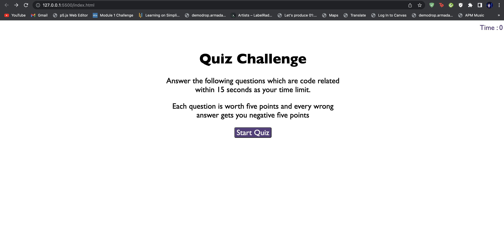
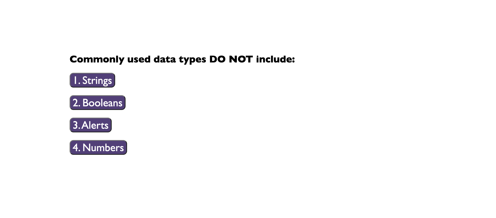
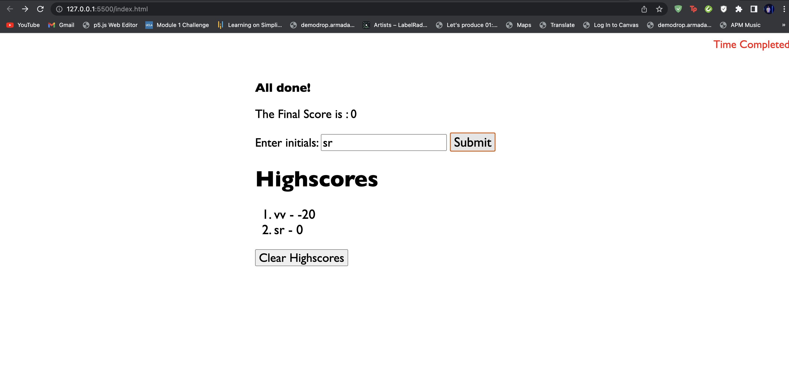

# Personal-Quiz# New-Sounds-in-Town

## Description

Provide a short description explaining the what, why, and how of your project. Use the following questions as a guide:

- What was your motivation?
   - to create A project that include multiple choice question with one right answer and tallys scores and saves it at the end.
- Why did you build this project? 
   - I wanted to build and intuitive website to conduct quizes on the go with negetive marking on the timing as well.
- What problem does it solve?
   - During the build of this project, I had to solve the problem of going from a user start screen which introduced the game, to then to cycle through questions and store a value in local storage then retieve the value and apply it to my webpage.
- What did you learn?
   - I learned how to make a page dynamic by hiding parts of my HTMl and populating elements on my HTML from my Javascript, although I wasnt able to get my Javascript to populate more than the first question, I tried several approaches, I attempted a while loop as well as a forEach loop each of which were not successful. I learned how to store values into local storage.

## Usage

Click on the link and attempt the quiz. Provide your initials and see your high score.

https://sankyrajeev.github.io/Personal-Quiz/

   md
   md
   md
    

## Credits

List your collaborators, if any, with links to their GitHub profiles.

If you used any third-party assets that require attribution, list the creators with links to their primary web presence in this section.

If you followed tutorials, include links to those here as well.

## License

The last section of a high-quality README file is the license. This lets other developers know what they can and cannot do with your project. If you need help choosing a license, refer to [https://choosealicense.com/](https://choosealicense.com/).

---

🏆 The previous sections are the bare minimum, and your project will ultimately determine the content of this document. You might also want to consider adding the following sections.

## Badges

Badges aren't necessary, per se, but they demonstrate street cred. Badges let other developers know that you know what you're doing. Check out the badges hosted by [shields.io](https://shields.io/). You may not understand what they all represent now, but you will in time.

## Features

If your project has a lot of features, list them here.

## How to Contribute

If you created an application or package and would like other developers to contribute it, you can include guidelines for how to do so. The [Contributor Covenant](https://www.contributor-covenant.org/) is an industry standard, but you can always write your own if you'd prefer.

## Tests

Go the extra mile and write tests for your application. Then provide examples on how to run them here.